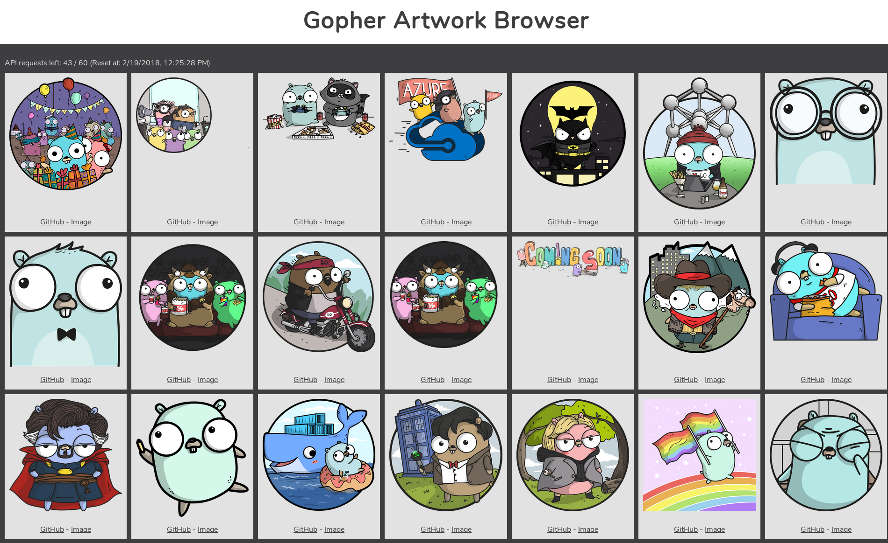

# Gopher Artwork Browser
Use this repository to visualize the [Gopher Artwork](https://github.com/ashleymcnamara/gophers/) by Ashley McNamara ([@ashleymcnamara](https://twitter.com/ashleymcnamara))

Powered entirely by Vue.js and recent browser features, no backend scripts needed at all.

I'm not a design-affinate person at all, so PRs for changing/enhancing the UI are more than welcome.

## Usage
Download or clone the repository to a local folder and start it as a local webserver (open the command-line in the project folder):
1. `npm i -g http-server` (installs a zero-configuration command-line http server globally)
2. `http-server .` (starts a http-server in the current directory)
3. Open the URL shown in the command-line output (usually `http://127.0.0.1:8080`)

## Limitations
- The raw images from GitHub are being loaded (bandwidth usage will be > 55MB!)
- Because the public Github API is being used, you are limited to 60 requests/h [Rate Limiting](https://developer.github.com/v3/#rate-limiting)
- Older browsers not supported (uses async-await, fetch, a few more modern features)

## ToDo (PRs are welcome)
- Add possibility to add OAuth token or Basic Authentication.
- Add ServiceWorker to enable offline-caching and reduce bandwidth usage and load times.
- Add styles to support mobile browsers.
- Add search functionality to filter the images.